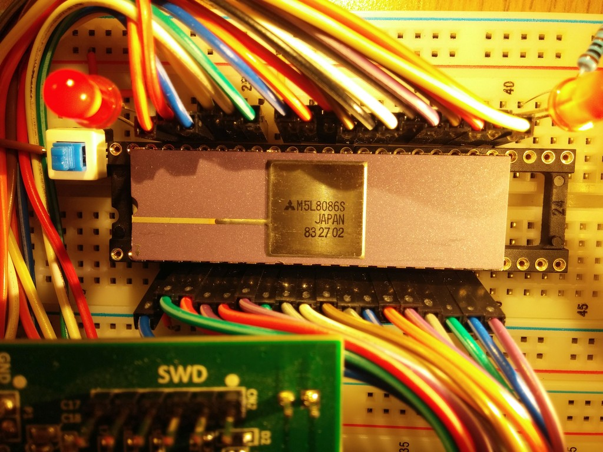
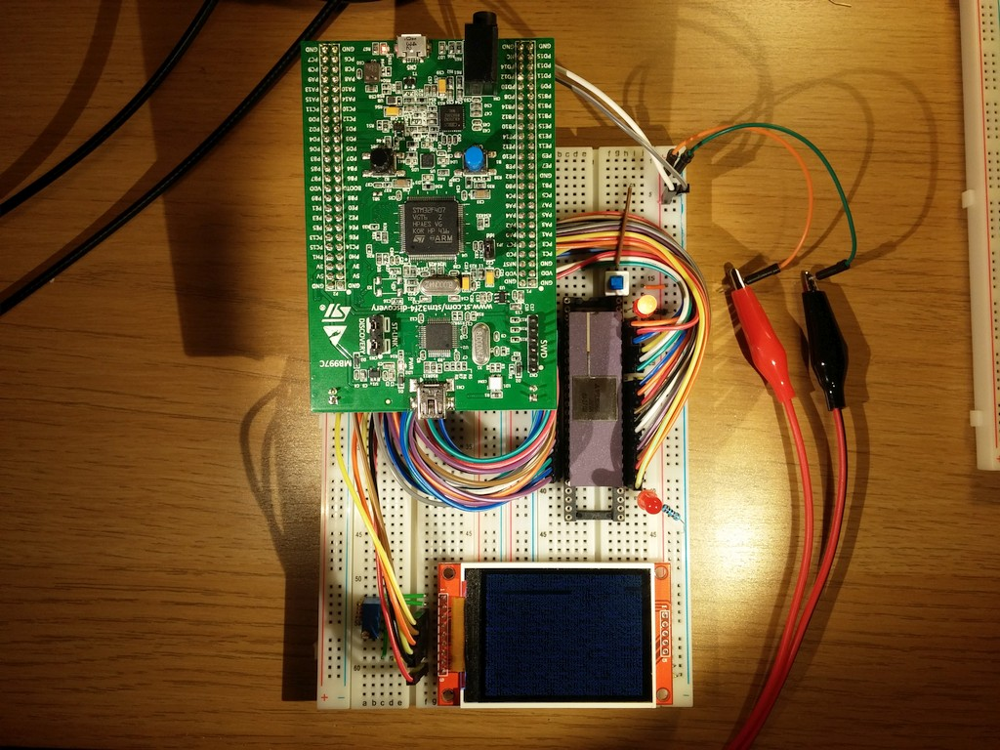
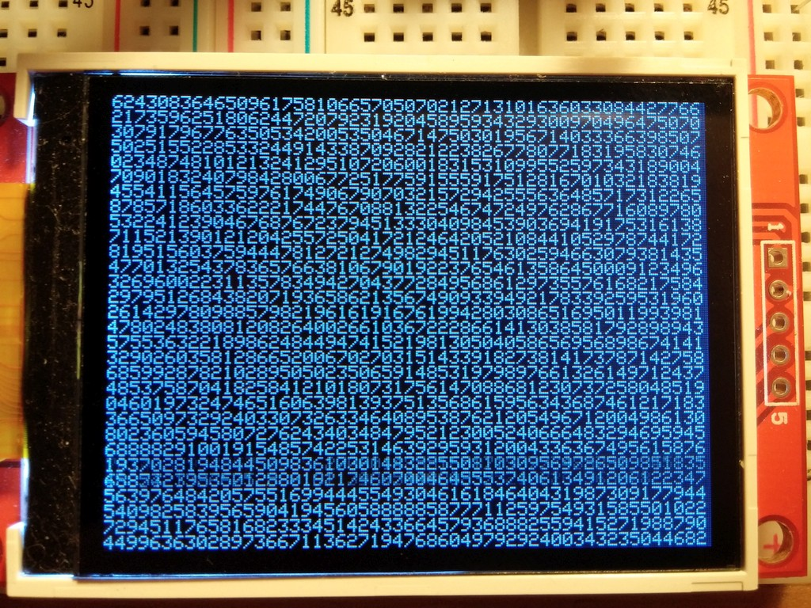

# stm32 + i8086 = ♥

### Intro

i8086 is very interesting chip, it was the chip which started personal computer era, all current desktop cpu's are compatible with it on binary level. It's very simple and yet powerful cpu, and it just looks beautiful.

To be able to build a minimal system with i8086 one needs 8284A clock generator, bus latches, 2142 RAM, 2716-2 ROM, some IO, etc. There are some projects to emulate chip set in CPLD/FPGA, for example : [http://tech.mattmillman.com/8od/](http://tech.mattmillman.com/8od/).

Instead of FPGA I decided to simulate chip-set in another MCU, so I choose stm32f407 because it's widely available on cheap stm32f4 discovery boards.

### How it works

Almost all i8086 pins are connected to stm32f4 board :

	i8086		stm32
	A00-A07		PA00-PA07
	A08-A09		PC04-PC05
	A10-A12		PB00-PB02
	A13-A20		PE07-PE14
	PIN32-PIN25	PD00-PD07
	PIN24-PIN21	PB03-PB06
	PIN17-PIN19	PB07-PB09

Plus I connected ILI9340 based screen to the board :

	lcd		stm32
	SPI		SPI2
	DC/RS	PB12
	RESET	PB11
	CS		PB10

stm32f4 simulate clock for i8086, and with polling it bitbang's CLK and read/write to pins on a same time, so this is how it's possible to enforce correct timings.

For now I only simulate small about of RAM :

	code segment : 0x10000 - 0x17fff
	data segment : 0x20000 - 0x27fff
	reset vector : 0xffff0 - 0xfffff

And only two IO devices :

	0x10 - put char on screen
	0x12 - return number char from 0 to 9

### Programs

Because it's x86, we can just use FASM (or any other asm compiler), instead of generating exe/com files, I just generate binaries directly (with org 0). This binaries are bundled with simulation software, and they get copied to code segment before i8086 starts.

I only created two test programs so far : memory write test and IO ports test, last one just reads random numbers from 0x12 port and prints them on the screen with 0x10 port.

### How it looks

I'm using Mitsubishi M5L8086S which was made in 1983 and still works !
This chip is a HMOS, not CMOS, so it gets a bit hot when it runs. Power consumption around 2.5 watts. 

This is overall look of the setup. Just 5v and it runs.

Random numbers from test program.

### TODO

- TW cycle
- test-wait instruction pair
- Interrupts
- Hlt instruction support
- 640k of RAM
- IBM PC compatible devices emulation 
- Attach PS2 keyboard
- BIOS
 
    